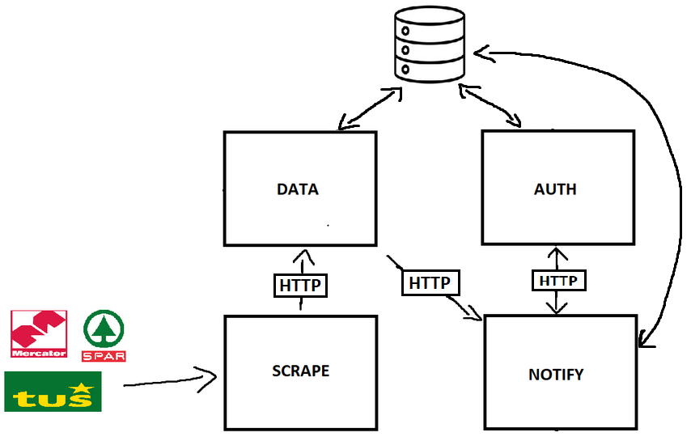

# Preceni

Vid Smole, Vid Purgar

## Opis

Preceni je spletni sledilnik cen, namenjen spremljanju in beleženju nihanja cen izdelkov, ki so na voljo v spletnih trgovinah slovenskih trgovcev. Uporabnikom omogoča, da poiščejo določene izdelke in spremljajo spreminjanje cene skozi čas, hkrati pa jim omogoča tudi vpogled v zgodovino cene izdelka. Z uporabo Preceni lahko uporabnik naredi bolj informiran nakup, saj ima več informacij o ceni izdelka in ga tako trgovec ne more zavesti s trajnimi popusti in višanjem cen pred začetkom akcij.

## Arhitektura

Rešitev je sestavljena iz štirih mikrostoritev:

- `preceni-data` - dostop do podatkov o izdelkih
  - prikaže trenutno ceno izdelka v različnih spletnih trgovinah
  - omogoča prikaz zgodovine cen izdelka
  - prikaže druge splošne podatke o izdelku (ime, opis, slike, ...)
  - napredno iskanje izdelkov glede na različne kriterije (trgovina, cena, kategorija, ...)
- `preceni-scrape` - web scraper za pridobivanje podatkov o izdelkih iz spletnih trgovin
  - pridobivanje podatkov iz spletnih trgovin slovenskih trgovcev (Mercator, Tuš, Hofer, Špar, ...)
  - uporablja API, če ta obstaja ali pa web scraping, če API ni na voljo
- `preceni-notify` - pošiljanje obvestil uporabnikom
  - uporabnike prek epošte ali drugih storitev obvesti, ko se cena izdelka spremeni (pade pod določeno mejo)
- `preceni-auth` - avtentikacija uporabnikov
  - login, register
  - upravljanje računa

Rešitev je narejena z uporabo ogrodja `NestJS` v okolju `Node.js`

## Primeri uporabe

- Uporabnik se registrira in prijavi v aplikacijo
- Uporabnik poišče izdelek, ki ga zanima
- Uporabnik primerja cene izdelka v različnih trgovinah
- Uporabnik primerja cene izdelka skozi čas
- Uporabnik doda izdelek na seznam opazovanih izdelkov in se s tem naroči na obvestila o spremembi cene izdelka
- V podatkovno bazo dodamo izdelek ali novo ceno izdelka
  - storitev `preceni-scrape` pridobi podatke o izdelku iz spletne trgovine
  - storitev `preceni-data` shrani podatke o izdelku v bazo podatkov ter shrani slike izdelka
  - storitev `preceni-notify` ugotovi ali gre za spremembo cene izdelka in pošlje obvestilo uporabnikom
- Rešitev uporabnika obvesti o spremembi cene izdelka
