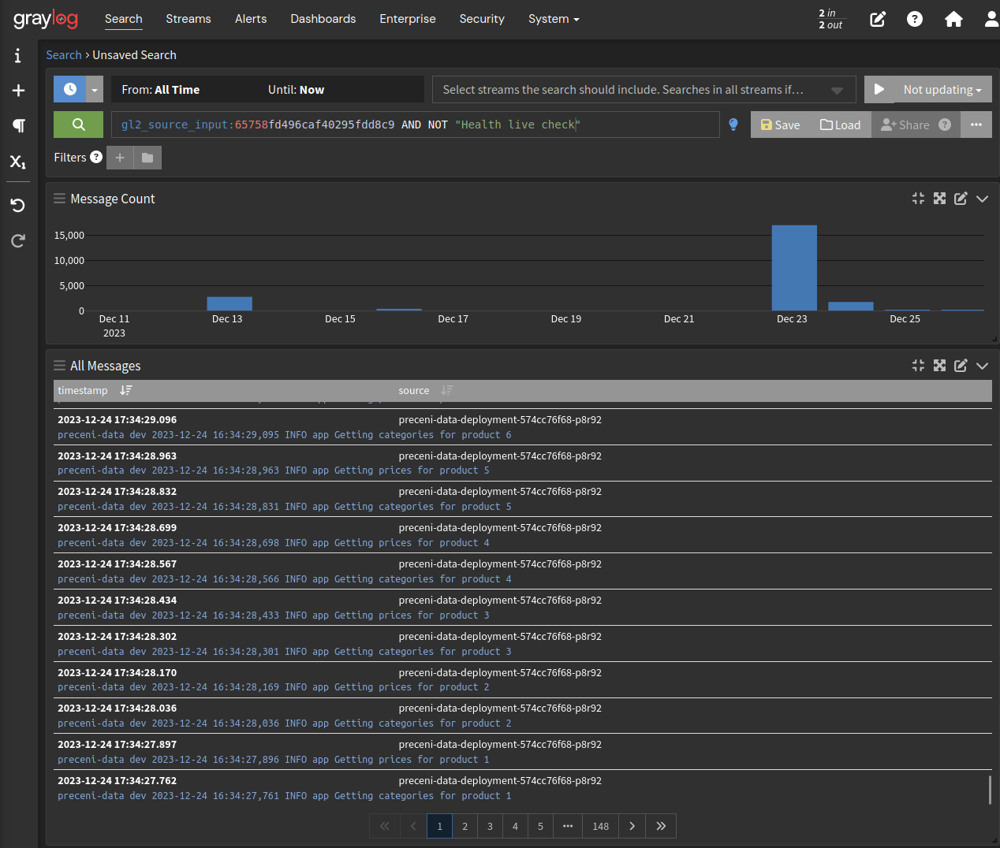
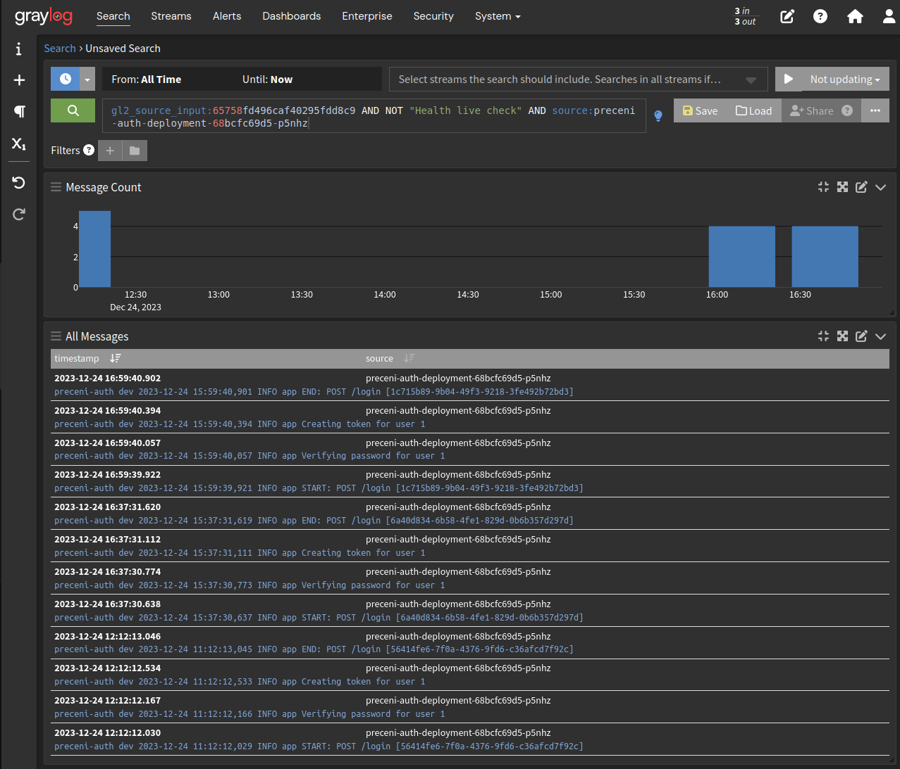
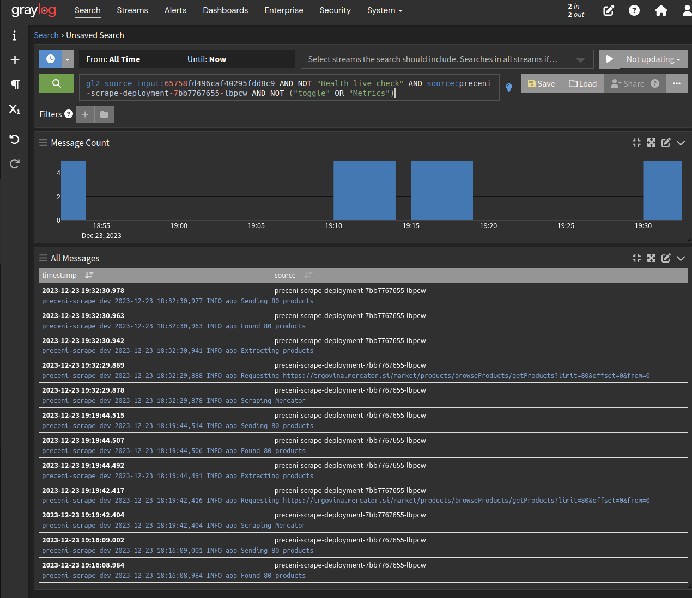

# Preceni

Vid Smole, Vid Purgar

## Opis

Preceni je spletni sledilnik cen, namenjen spremljanju in beleženju nihanja cen izdelkov, ki so na voljo v spletnih trgovinah slovenskih trgovcev. Uporabnikom omogoča, da poiščejo določene izdelke in spremljajo spreminjanje cene skozi čas, hkrati pa jim omogoča tudi vpogled v zgodovino cene izdelka. Z uporabo Preceni lahko uporabnik naredi bolj informiran nakup, saj ima več informacij o ceni izdelka in ga tako trgovec ne more zavesti s trajnimi popusti in višanjem cen pred začetkom akcij.

## URL

- <https://preceni-ui.smole.org>: Uporabniški vmesnik

- Mikrostoritve:
  - <https://rso.smole.org/data>
  - <https://rso.smole.org/auth>
  - <https://rso.smole.org/notify>
  - <https://rso.smole.org/scrape>

## Mikrostoritve

- `preceni-data` ([GitHub](https://github.com/RSO-32/preceni-data), [DockerHub](https://hub.docker.com/r/vidvidex/preceni-data)) - dostop do podatkov o izdelkih
  - prikaže trenutno ceno izdelka v različnih spletnih trgovinah
  - omogoča prikaz zgodovine cen izdelka
  - prikaže druge splošne podatke o izdelku (ime, opis, slike, ...)
  - napredno iskanje izdelkov glede na različne kriterije (trgovina, cena, kategorija, ...)
- `preceni-scrape` ([GitHub](https://github.com/RSO-32/preceni-scrape), [DockerHub](https://hub.docker.com/r/vidvidex/preceni-scrape)) - web scraper za pridobivanje podatkov o izdelkih iz spletnih trgovin
  - pridobivanje podatkov iz spletnih trgovin slovenskih trgovcev (Mercator, Tuš, Hofer, Špar, ...)
  - uporablja API, če ta obstaja ali pa web scraping, če API ni na voljo
- `preceni-notify` ([GitHub](https://github.com/RSO-32/preceni-notify), [DockerHub](https://hub.docker.com/r/vidvidex/preceni-notify)) - pošiljanje obvestil uporabnikom
  - uporabnike prek epošte ali drugih storitev obvesti, ko se cena izdelka spremeni (pade pod določeno mejo)
- `preceni-auth` ([GitHub](https://github.com/RSO-32/preceni-auth), [DockerHub](https://hub.docker.com/r/vidvidex/preceni-auth)) - avtentikacija uporabnikov
  - login, register
  - upravljanje računa
- `preceni-ui` ([GitHub](https://github.com/RSO-32/preceni-ui), [Uporabniški vmesnik](https://preceni-ui.smole.org/)) - preprost uporabniški vmesnik
  - pregled izdelkov
  - registracija, prijava
  - naročilo na obvestila o spremembi cene izdelka
- `preceni-docs` ([GitHub](https://github.com/RSO-32/preceni-docs)) - dokumentacija

## Ogrodje

- Zaledne storitve so narejene z uporabo ogrodja Flask.
- Uporabniški vmesnik je narejen z uporabo Vue.js

## Razvojno okolje

  Storitve so bile razvite z uporabo VSCode, za pošiljanje zahtevkov pa sva uporabila orodje Postman.

## Zunanji API
  <!--Kratek opis uporabe zunanjih API-jev v vaših rešitvah.-->
- `Mercator API` - pridobivanje podatkov (ime, cena, slike, ...) o izdelkih iz spletne trgovine Mercator
- `Barcode API` - dodajanje novih izdelkov in cen preko črtne kode

## Shema arhitekture
  <!--Shemo arhitekture in interakcij med mikrostoritvami. Označite tudi komunikacijske protokole med mikrostoritvami.-->
  

## Konfiguracija
  <!--Kratek opis uporabe različnih virov konfiguracije v vaših rešitvah (okoljske spremenljivke, konfiguracijska datoteka, skrivnosti).-->
- Okoljske spremenljivke: Za shranjevanje konfiguracije (npr. `PYTHONUNBUFFERED`)
- Skrivnosti: Za shranjevanje ključev (npr. `RAPIDAPI_KEY`)

## Kontrole zdravja in metrike
  <!--Seznam implementiranih kontrol zdravja in metrik.-->
Kontrole zdravja so implementirane na končnih točkah `/health/live`, metrike pa na končnih točkah `/metrics`.
Metrike so zapisane v formatu `Prometheus`.

- Kontrole zdravja:
  - `preceni-data`:
    - database
    - disk
    - test (za simuliranje bolne mikrostoritve)
  - `preceni-scrape`:  
    - disk
    - test (za simuliranje bolne mikrostoritve)
  - `preceni-notify`:
    - database
    - disk
    - test (za simuliranje bolne mikrostoritve)
  - `preceni-auth`:
    - database
    - disk
    - test (za simuliranje bolne mikrostoritve)

- Metrike:
  - `preceni-data`:
    - disk total
    - disk used
    - disk free
    - cpu percent
    - ram percent
  - `preceni-scrape`:  
    - disk total
    - disk used
    - disk free
    - cpu percent
    - ram percent
    - requests delay seconds
    - mercator scraper on
    - mercator api endpoint (za testiranje fault tolerance)
  - `preceni-notify`:
    - disk total
    - disk used
    - disk free
    - cpu percent
    - ram percent
  - `preceni-auth`:
    - disk total
    - disk used
    - disk free
    - cpu percent
    - ram percent

## Beleženje dnevnikov

Za beleženje dnevnikov uporabljava storitev `Graylog`, na katero vse mikrostoritve pošiljajo svoje dnevniške zapise.
V vsakem zapisu je med drugim tudi podatek o:

- imenu mikrostoritve
- okolju v katerem se mikrostoritev izvaja
- nivoju sporočila (INFO, WARNING, ERROR, ...)

### Nekaj poizvedb

Prikaz vseh sporočil razen healthcheckov:


Prikaz prijav uporabnikov:


Delovanje storitve `preceni-scrape`:


## Izolacija in toleranca napak
  <!--Kratek opis demonstracije za izolacijo in toleranco napak, ki ste jo pripravili za vašo aplikacijo.-->

Dodala sva izolacijo napak pri pridobivanju podatkov iz Mercatorjevega APIja, saj nad njim nimava nadzora, hkrati pa se lahko zgodi, da se ta nenapovedano spremeni.
V primeru napak bo mikrostoritev odprla prekinjevalec toka, ki bo preprečil nadaljnje pošiljanje zahtevkov na Mercatorjev API.
Nato bo počakala nekaj sekund in poskusila ponovno (pol-odprto stanje).
Če bo zahteva tokrat uspešna, se bo prekinjevalec toka zaprl in mikrostoritev bo nadaljevala z delovanjem, drugače pa bo poskusila še 2x, nato pa prešla v trajno odprto stanje.

### Primer z prehodom v trajno odprto stanje

Napako sva simulirala tako, da sva storitvi podala napačen URL za Mercatorjev API.

```txt
[2023-12-26 11:06:36,186] INFO in mercator: Scraping Mercator
[2023-12-26 11:06:36,187] INFO in mercator: Requesting https://trgovina.mercrator.si/market/products/browseProducts/getProducts?limit=80&offset=0&from=0
[2023-12-26 11:06:36,190] ERROR in mercator: Received HTTP error, opening circuit breaker
[2023-12-26 11:06:36,190] INFO in mercator: Waiting before retrying
[2023-12-26 11:06:41,191] INFO in mercator: Half-opening circuit breaker
[2023-12-26 11:06:41,193] ERROR in mercator: API still down
[2023-12-26 11:06:41,194] INFO in mercator: Waiting before retrying
[2023-12-26 11:06:46,194] INFO in mercator: Half-opening circuit breaker
[2023-12-26 11:06:46,197] ERROR in mercator: API still down
[2023-12-26 11:06:46,198] INFO in mercator: Waiting before retrying
[2023-12-26 11:06:51,198] INFO in mercator: Half-opening circuit breaker
[2023-12-26 11:06:51,200] ERROR in mercator: API still down
[2023-12-26 11:06:51,201] ERROR in mercator: Permanently opening circuit breaker
```

### Primer z uspešnim okrevanjem in prehodom v normalno delovanje

```
[2023-12-26 11:13:24,182] INFO in mercator: Starting Mercator scraper
[2023-12-26 11:13:24,186] INFO in mercator: Scraping Mercator
[2023-12-26 11:13:24,187] INFO in mercator: Requesting https://trgovina.mercrator.si/market/products/browseProducts/getProducts?limit=80&offset=0&from=0
[2023-12-26 11:13:24,194] ERROR in mercator: Received HTTP error, opening circuit breaker
[2023-12-26 11:13:24,195] INFO in mercator: Waiting before retrying
[2023-12-26 11:13:34,198] INFO in mercator: Half-opening circuit breaker
[2023-12-26 11:13:34,202] ERROR in mercator: API still down
[2023-12-26 11:13:34,203] INFO in mercator: Waiting before retrying
[2023-12-26 11:13:37,069] INFO in app: PUT: Mercator endpoint
[2023-12-26 11:13:44,211] INFO in mercator: Half-opening circuit breaker
[2023-12-26 11:13:44,599] INFO in mercator: API is up, closing circuit breaker
[2023-12-26 11:13:49,604] INFO in mercator: Scraping Mercator
[2023-12-26 11:13:49,605] INFO in mercator: Requesting https://trgovina.mercator.si/market/products/browseProducts/getProducts?limit=80&offset=1&from=80
[2023-12-26 11:13:49,948] INFO in mercator: Extracting products
[2023-12-26 11:13:49,954] INFO in mercator: Found 80 products
[2023-12-26 11:13:49,955] INFO in product: Sending 80 products
```

## OpenAPI

OpenAPI dokumentacija je na voljo na naslednjih povezavah:

- <http://rso.smole.org/data/openapi/swagger>
- <http://rso.smole.org/notify/openapi/swagger>
- <http://rso.smole.org/auth/openapi/swagger>

## GraphQL

- <http://rso.smole.org/data/graphql>
